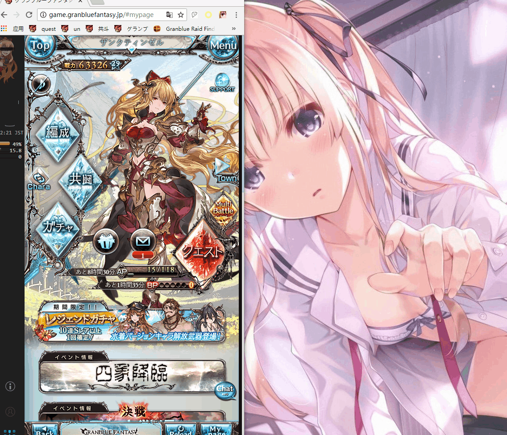

# liver-collection


English | [简体中文](./README-zh_CN.md)

- **Note: The author doesn't play this game anymore, only maintain dependent updates for security issue**

- Used as a Viramate feature completion

- Make good use of the chrome browser multi-user login function to create a separate account for your gbf

- Due to insufficient testing, it is recommended to reduce the risk of bugs as demonstrated in the gif

- If you encounter a bug, you can refresh your game page and try again

## ✨ Features

- Entry boss room with two steps [Demo](#两键舔婊)
- Entry boss room with one step. Need to open option **`监听剪切板`** [demo](#一键舔婊)
- ~~Used for daily records. Of course, if you want to build a database locally~~
- Hide all sidebars [Demo](#隐藏侧边栏)
- Tweak the style of scroll bar [Demo](#修改滚动条)
- Room search in coopraid. Rooms that does not match conditions will be hidden [Demo](#共斗搜索)
- ~~Tweak window size~~ [Demo](#修改窗口大小)
- View all teammates in the room [Demo](#查看天人)
- Switches for controlling sidebars both sides
- Coopraid room black list [Demo](#黑名单)
- ~~Check your homework~~ [Demo](#检查作业)
- Keyboard support
  - Key `F` for refresh
  - Key `D` for jumping to your customized address and use items automatically. Need to fill in the address by yourself, in option page - 通用设置
- Hide irrelevant items in homepage. [Demo](#隐藏无关项)
- Entry to single battle and use items automatically
- Notify is there is a HL at result page. Need to open options

## 🔨 Usage

1. Download [release](https://github.com/breathing-is-fun/liver-collection/releases/tag/1.1.6) for `dist`

2. This is the core of plugin, and the rest is to search for how to add this folder to your browser as extension

## ⌨️ Development

```bash
$ git clone https://github.com/breathing-is-fun/liver-collection.git
$ cd liver-collection
$ npm install
$ npm run build
```

## Demo

### 隐藏侧边栏


### 修改滚动条


### 共斗搜索


### 修改窗口大小


### 查看天人


### 黑名单


### 两键舔婊


### 一键舔婊



### 检查作业


### 隐藏无关项


